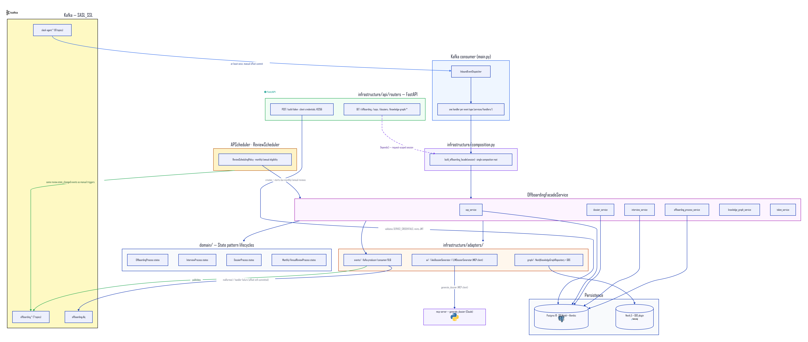

# backend — Architecture

Part of **BrainTrust**. FastAPI backend that orchestrates the offboarding lifecycle (interview → dossier → completion), consumes Kafka events published by `slack-agent`, and delegates dossier writing to `mcp-server`'s `generate_dossier` tool.

## Component diagram



> Source: [`architecture.d2`](architecture.d2) · Vector: [`architecture.svg`](architecture.svg)

### Regenerate the diagram

```bash
d2 --theme 0 --pad 40 architecture.d2 architecture.svg            # vector
d2 --theme 0 --pad 40 --scale 2 architecture.d2 architecture.png  # raster
```

> **Known issue:** as of d2 v0.7.1, PNG export needs Playwright's headless-browser driver, and the driver's default CDN currently 404s on the pinned version. Workaround: render the SVG above, then rasterize it directly (icons are embedded as base64 data URIs, no network access needed):
> ```bash
> npx -y @resvg/resvg-js-cli architecture.svg architecture.png
> ```

See [`../../../slack-agent/docs/architecture/`](../../../slack-agent/docs/architecture/) for the cross-repo system diagram this fits into.

## Hexagonal layers

Under `src/app/`:

- **`domain/`** — Entities, value objects, domain events, exceptions. Zero framework dependencies. Lifecycles (`offboarding/`, `interview/`, `dossier/`, monthly/annual review) are modeled as **State pattern**: each has a `process.py` holding a `state`, plus a `state/` subpackage with one concrete state class per lifecycle stage, all extending `state/base.py`.
- **`application/`** — `ports/` (interfaces infrastructure must implement — event publisher, dossier generator, graph database, repositories), `service_interfaces/`, `services/` (use cases: `offboarding_facade_service.py` fronts `offboarding_process_service`, `interview_service`, `dossier_service`, `sop_service`, `knowledge_graph_service`, `token_service`). `services/handlers/` holds one handler per inbound Kafka event type, dispatched by `inbound_event_dispatcher.py`.
- **`infrastructure/`** — `api/routers/` (FastAPI routers — read-only, see below), `adapters/` (`ai/` — `FakeDossierGenerator`/`LLMDossierGenerator`; `events/` — Kafka producer/consumer/DLQ; `graph/` — Neo4j), `persistence/` (SQLModel models + engine), `scheduling/` (APScheduler `ReviewScheduler`), `config/settings.py`.

### Schema migrations own production

Alembic (`alembic/`) owns the Postgres schema — `env.py` reads the connection URL from `Settings` and targets `SQLModel.metadata`. `main.py`'s lifespan only calls `init_engine()`, never `create_all()`. When a model changes, generate a migration with `alembic revision --autogenerate` and review it by hand (autogenerate misses raw-SQL items like the GIN full-text index on `sops.content`).

### Two composition roots, kept in sync deliberately

`infrastructure/composition.py` is the single place that assembles a fully-wired `OffboardingFacadeService` from a `Session`, because two call sites need it and can't share a DI mechanism: FastAPI routes build it via `Depends` (request-scoped session); the Kafka consumer (`main.py`) calls `composition.build_offboarding_facade()` by hand, once per message. New services/dependencies get wired in `composition.py`, not ad hoc in either call site.

## REST is read-only — Kafka is the only write path

Every REST endpoint except `POST /auth/token` and `GET /health*` requires a JWT Bearer token. The API only exposes `GET`/list/search — no `POST/PATCH/DELETE` for offboarding/interview/dossier/SOP state. All writes arrive as Kafka events on `slack-agent.*` topics, routed through `InboundEventDispatcher` → the matching handler. Malformed messages or handler failures go to `offboarding.dlq` with `source_topic`/`error` headers — the offset still commits, so a bad message never blocks the consumer.

**(BE-21)** SOP `PATCH`/`DELETE` were the last documented exception to this rule; they've migrated to `sop.update_requested`/`sop.deletion_requested` inbound events, so the invariant now holds with no exceptions.

The canonical contract is `docs/asyncapi/asyncapi.yml` (AsyncAPI 3.0.0) — **if this doc and the spec disagree, the spec wins**.

### Interview turns and SOP candidates persist incrementally (SA-16)

Two inbound topics close the gap where slack-agent used to hold in-flight state only in process memory:

- **`interview.turn_recorded`** appends turns into the existing `interview_turns` table as they accumulate, instead of waiting for the full set at `interview.completed` (kept as a reconciliation backstop). Handler dedups by `turn_order` to stay idempotent under out-of-order, at-least-once delivery.
- **`sop.candidate_offered`/`sop.candidate_decided`** persist a `SopCandidate` aggregate (`sop_candidates` table) tracking a candidate message's offered → accepted/rejected lifecycle, so slack-agent can rehydrate pending candidates (`GET /sop-candidates`, read-only) after a restart.

## AI dossier generation is pluggable

`IDossierGenerator` decouples dossier content from the rest of the flow. `FakeDossierGenerator` (deterministic) is the always-available fallback. `LLMDossierGenerator` is a thin MCP client — the LLM itself (Claude) runs in **mcp-server**, not here; this adapter formats the interview transcript and calls mcp-server's `generate_dossier` tool. The whole round trip is wrapped in a timeout + broad `except Exception`, falling back to `FakeDossierGenerator` on any failure so the Kafka consumer never breaks. Feature-flagged via `DOSSIER_LLM_ENABLED`.

## Knowledge graph (SA-19)

`GET /api/v1/knowledge-graph/*` (JWT-guarded, read-only) exposes `persons`, `topics`, `experts`, `topics/{name}/related`, `topics/{name}/documents`, `persons/{id}`, plus:

- `GET /analytics` — per-person **Louvain community**, weighted **PageRank**, and **betweenness/broker score** via Neo4j **GDS** over a person-to-person projection. Broker score is the headline offboarding-risk signal.
- `GET /persons/{id}/successors` — GDS **Node Similarity** (Jaccard over shared topics): who could plausibly cover for this person.
- GDS is optional at runtime — if the plugin or Neo4j itself is unavailable, both endpoints degrade to `200 []` rather than erroring.

## Periodic review scheduling (BE-24)

An in-process **APScheduler** job (`ReviewScheduler`), started/stopped in the FastAPI lifespan, runs once a day (default 03:00 UTC) and creates/starts due `MonthlyReviewProcess`/`AnnualReviewProcess` instances via the same facade services the Kafka handlers use — so a scheduled review is indistinguishable to slack-agent from a manually triggered one. Eligibility (`ReviewSchedulingPolicy`) is derived entirely from processes already on record (no separate roster) and re-evaluated from scratch each sweep, so a missed run self-heals. Feature-flagged via `REVIEW_SCHEDULING_ENABLED`.

## Auth

Client-credentials grant at `POST /api/v1/auth/token` (HS256, `JWT_SECRET`, `aud=JWT_AUDIENCE`). Valid pairs come from `SERVICE_CREDENTIALS`. Tokens expire after `TOKEN_EXPIRY_SECONDS` (default 300s) — callers cache and refresh, they don't mint their own.

## Related

- [`slack-agent/docs/architecture/`](../../../slack-agent/docs/architecture/) — cross-repo system diagram.
- [`mcp-server/docs/architecture/`](../../../mcp-server/docs/architecture/) — mcp-server component diagram + doc.
- [`backend/README.md`](../../README.md) — full Kafka topic tables, AsyncAPI tooling, local dev setup.
